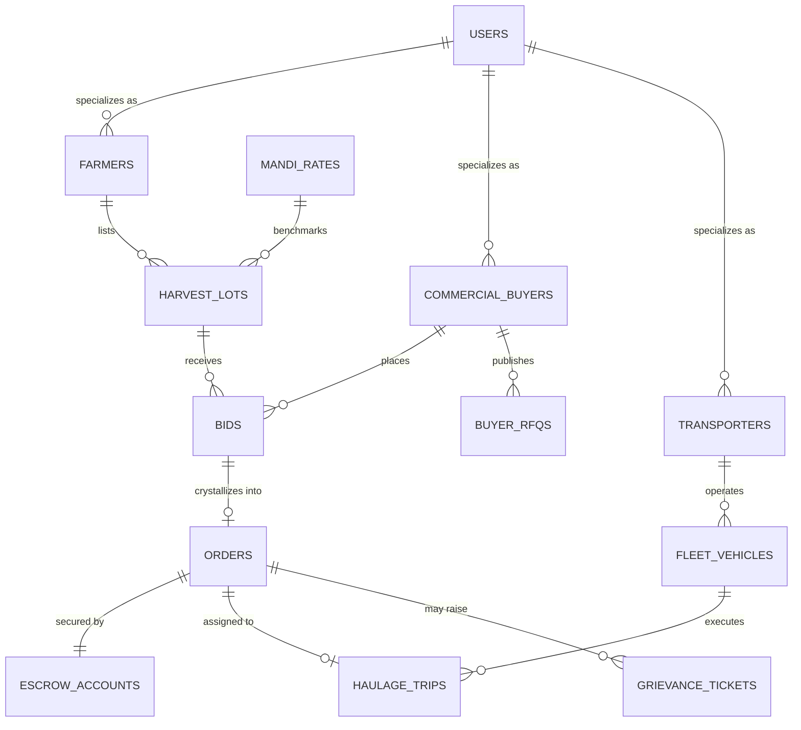

# Kissan Connect (కిసాన్ కనెక్ట్)
## Integrated Database Architecture & Backend Developer Guide

Welcome! This documentation is specifically prepared for the backend team integrating databases, authentication, and REST/GraphQL APIs for **Kissan Connect**.

---

## 1. System & Database Architecture

Kissan Connect follows a **Federated Domain-Driven Design (DDD)** where each business actor operates on a distinct bounded context, while the **Integrated Core DB** acts as the central source of truth for transactions, escrows, and market intelligence:

```
                          ┌──────────────────────────┐
                          │    MAIN GATEWAY PORTAL   │
                          │  (Role Selector & Auth)  │
                          └─────────────┬────────────┘
                                        │
         ┌──────────────────────────────┼──────────────────────────────┐
         │                              │                              │
         ▼                              ▼                              ▼
┌──────────────────┐           ┌──────────────────┐           ┌──────────────────┐
│  FARMER PORTAL   │           │   BUYER PORTAL   │           │ LOGISTICS PORTAL │
│   (రైతు వేదిక)   │           │ (కొనుగోలుదారు)   │           │   (రవాణా వేదిక)  │
└────────┬─────────┘           └────────┬─────────┘           └────────┬─────────┘
         │                              │                              │
         ▼                              ▼                              ▼
┌──────────────────┐           ┌──────────────────┐           ┌──────────────────┐
│    FARMER DB     │           │     BUYER DB     │           │   LOGISTICS DB   │
│ (Harvests, Ask   │           │ (RFQs, Bids,     │           │ (Fleet, Trips,   │
│  Prices, Bids)   │           │  Procurements)   │           │  Waybills, OTPs) │
└────────┬─────────┘           └────────┬─────────┘           └────────┬─────────┘
         │                              │                              │
         └──────────────────────┬───────┴──────────────────────────────┘
                                │
                                ▼
               ┌─────────────────────────────────┐
               │     MASTER INTEGRATED DB        │
               │  • Digital Escrow Ledger        │
               │  • Order State Engine           │
               │  • Telangana APMC Mandi Rates   │
               │  • Cross-Portal Event Sync Bus  │
               └─────────────────────────────────┘
```

---

## 2. Entity Relationship (ER) Diagram



---

## 3. Database Schemas by Domain

### A. Integrated Master DB (`integrated_db/master_schema.sql`)
Unifies all entities with foreign keys, cascading constraints, and audit timestamps.
- **`users`**: Global authentication accounts with phone, role (`farmer`, `buyer`, `logistics`, `admin`), and KYC status.
- **`mandi_prices`**: Real-time Telangana APMC market yard rates (Warangal Enumamula, Khammam, Nizamabad, Miryalaguda, Suryapet, Adilabad).
- **`escrow_ledger`**: Complete immutable financial ledger recording Buyer Locks, Farm-Gate OTP Releases, Transport Freight Releases, and Dispute Freezes.
- **`orders`**: 5-stage lifecycle state machine (`ACCEPTED` → `ESCROW_LOCKED` → `TRUCK_DISPATCHED` → `OTP_VERIFIED` → `FARMER_PAID`).

### B. Farmer DB (`farmer_portal/db/farmer_schema.sql`)
- **`farmer_profiles`**: Rythu Bandhu ID, land passbook details, village/mandal, verified bank account (IFSC, Account Number).
- **`harvest_lots`**: Crop key (`paddy`, `teja_chilli`, `cotton`, `turmeric`), quantity in quintals, quality grade (`A`, `B`, `C`), moisture %, reserve ask price, image URLs.
- **`farmer_bids`**: Inward bids from buyers with price, buyer credit score, and logistics terms.
- **`dispute_tickets`**: Weight scale discrepancy, truck delay, or grading grievance tickets.

### C. Buyer DB (`buyer_portal/db/buyer_schema.sql`)
- **`buyer_profiles`**: GSTIN, APMC Mandi Trader License, company name, contact, escrow deposit balance.
- **`buyer_active_bids`**: Bids placed on farmer lots, current rank (`LEADING`, `OUTBID`), counter-offer terms.
- **`procurement_orders`**: Confirmed purchase orders, weighment slips, APMC cess calculation, digital GST tax invoices.
- **`buyer_rfqs`**: Bulk procurement tenders posted to farmers and FPOs.

### D. Logistics DB (`logistics_portal/db/logistics_schema.sql`)
- **`transporter_profiles`**: Transport agency name, PAN, operational mandis, driver fleet count.
- **`fleet_vehicles`**: Vehicle registration (e.g. `TS 03 UB 8192`), vehicle type (Tractor, DCM 14ft, 10-Ton Multi-axle), RC status.
- **`haulage_trips`**: Origin farm gate, destination mandi/warehouse, farmer OTP verification, freight amount, release status.

---

## 4. API Endpoints Specification

### 1. Authentication & Session
- `POST /api/auth/otp/send` - Send 6-digit SMS OTP to Indian mobile number (`+91`).
- `POST /api/auth/otp/verify` - Verify OTP and return JWT session token with user profile.

### 2. Farmer Endpoints
- `GET /api/farmer/lots` - Get active farmer harvest lots and received bids.
- `POST /api/farmer/lots` - Create harvest listing with photos and demand-driven reserve price.
- `POST /api/farmer/lots/:lotId/bids/:bidId/accept` - Accept buyer bid (initiates Escrow order).
- `POST /api/farmer/lots/:lotId/bids/:bidId/counter` - Submit counter offer to buyer.
- `GET /api/farmer/escrow` - Get farmer escrow balance and transaction history.
- `POST /api/farmer/disputes` - Raise a grievance ticket to freeze escrow.

### 3. Buyer Endpoints
- `GET /api/buyer/lots` - Search & filter harvest lots (crop, mandi, grade, moisture).
- `POST /api/buyer/bids` - Place a competitive bid on a farmer lot.
- `GET /api/buyer/bids/active` - Get buyer's placed bids with status (`LEADING`, `OUTBID`, `COUNTER`).
- `POST /api/buyer/orders/:orderId/assign-truck` - Assign vehicle number & driver for pickup.
- `POST /api/buyer/rfqs` - Post bulk requirement tender for farmers/FPOs.
- `GET /api/buyer/invoice/:orderId` - Generate APMC / GST electronic weighment invoice.

### 4. Logistics Endpoints
- `GET /api/logistics/available-trips` - Browse pending produce haulage trips.
- `POST /api/logistics/trips/:tripId/accept` - Accept trip and assign vehicle.
- `POST /api/logistics/trips/:tripId/verify-otp` - Enter Farm-Gate OTP to verify loading and unlock freight.

### 5. Shared & Integrated Endpoints
- `GET /api/mandi/rates` - Get real-time Telangana APMC mandi rates.
- `GET /api/mandi/trends/:crop` - Get historical price trends and arrivals for Chart.js.

---

## 5. Quick Start for Backend Setup

### Using PostgreSQL / SQLite
```bash
# 1. To initialize the unified integrated database:
psql -U postgres -d kissan_connect -f integrated_db/master_schema.sql

# Or using SQLite:
sqlite3 kissan_connect.db < integrated_db/master_schema.sql
```

### Loading Seed Data
Each portal has a pre-populated `seed.json` file in its `db/` folder:
- `integrated_db/master_seed.json` - Complete synchronized data.
- `farmer_portal/db/farmer_seed.json` - Farmer profiles and harvest lots.
- `buyer_portal/db/buyer_seed.json` - Commercial buyers and procurement orders.
- `logistics_portal/db/logistics_seed.json` - Transporter profiles and fleet trucks.

---

## 6. Frontend Mock / Local Database Clients

Each portal contains an in-browser database abstraction module (`farmer_db.js`, `buyer_db.js`, `logistics_db.js`, `integrated_db.js`). 
When you are ready to connect real endpoints:
1. Simply replace the `localStorage` / in-memory handlers in those files with your `fetch()` or `axios()` calls to your backend API.
2. The method signatures are already standardized (e.g., `getLots()`, `createLot()`, `placeBid()`, `acceptBid()`, `verifyOtp()`).

Have questions or need adjustments to the schema? Kissan Connect's modular folder layout is ready for your backend integration!
